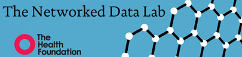

# Networked Data Lab: NDL Liverpool and Wirral analysis on *[please fill in]*

#### Project Status: In-progress

## Project Description

- This Networked Data Lab analysis by the NDL lab in Liverpool and Wirral focusses on *[please fill in]*.
- Please note that these research outputs have not yet been peer-reviewed and should be treated as preliminary.

## Data sources

This analysis used the following data: 

- Secondary User Service (SUS) – used to extract data on hospital admissions
- Emergency Care Dataset (ECDS) – used to extract data on A&E attendances
- Mental health Service Data Set (MHSDS) – used to extracts referrals to and contacts with 
Children and Adolescent Mental Health Services (CAMHS) and Adult Mental Health Services
(AMHS). These we collectively refer to below as routine mental health services. These are 
contacts with services that provide routine care for people suspected or diagnosed mental 
health and wellbeing need, learning disabilities, autism, or other neurodevelopmental 
conditions. They are distinct from emergency admissions or A&E attendances in the other 
data sources, that may occur due to a crisis. 
- Emergency hospital admissions for self-harm, alcohol, and substance abuse, eating disorders 
and other mental health problems. (Extracted from SUS)
- Attendance to A&E for self-harm, alcohol, and substance abuse, eating disorders. (Extracted 
from ECDS)
- Any referrals to Mental Health Services. (Extracted from MHSDS)
- Any contacts Mental Health Services. (Extracted from MHSDS)
- People with any contact with health services for a mental health problem – defined as any 
person with at least one of the outcomes 1-4, during this period.

## How does it work?

## Requirements

These scripts were written in *[please fill in]*.

## Getting started

A short description of what each code does, and what each file is. *[please fill in]*.

## Authors

- Author 1 - [contact](name@domain.ac.uk)
- Author 2 - [contact](name@domain.ac.uk)
- Author 3 - [contact](name@domain.ac.uk)

## License

This project is licensed under the [MIT License](https://opensource.org/licenses/MIT).
